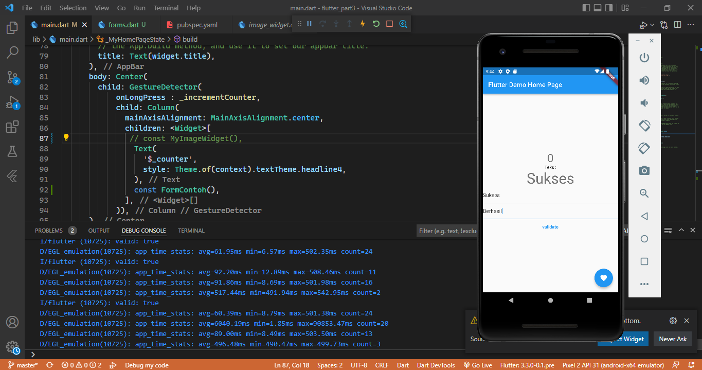

## Flutter Fundamental - Bagian 3

A new Flutter project.

# Praktikum 1: Menerapkan Gesture Detector
# onTap
Pada praktikum ini, onTap berfungsi apabila menekan button. onTap  sama dengan click. Fungsi onTap sendiri yaitu setiap  meng-klik button 1x maka angka akan bertambah 1.

# onDoubleTap
Pada praktikum ini, onDoubleTap berfungsi apabila menekan button. onDoubleTap jika  meng-klik button 2x atau dobel maka angka akan bertambah 1.

# onLongPress
Pada praktikum ini, onLongPress berfungsi apabila menekan button. onLongPress jika menekan dan menahan beberapa detik maka angka akan bertambah 1.

# Praktikum 2: Menerapkan Input Widget dan Forms
Pada praktikum gambar dibawah ini, terdapat form input yang memberikan validasi pada form nya. pada form input yang pertama diberi validasi apabila form kosong atau tidak ada isi maka akan muncul pesan bahwa form tidak boleh kosong, dan jika form diisi maka terdapat valdiasi true(valid).
# Kodisi True(Valid)

# Kondisi tidak valid

# Praktikum 3: Menerapkan Custom Input dan FormField Widget
Pada praktikum gambar dibawah ini, terdapat custom input untuk mengatur keyboardnya yang berisakan number yang formnya di filter hanya menerima data berupa angka. dan pada praktikum tidak bisa memasukkan angka lebih dari 6 digit. karena dilakukan custom input hanya menerima data angka maksimal 6 digit saja.

